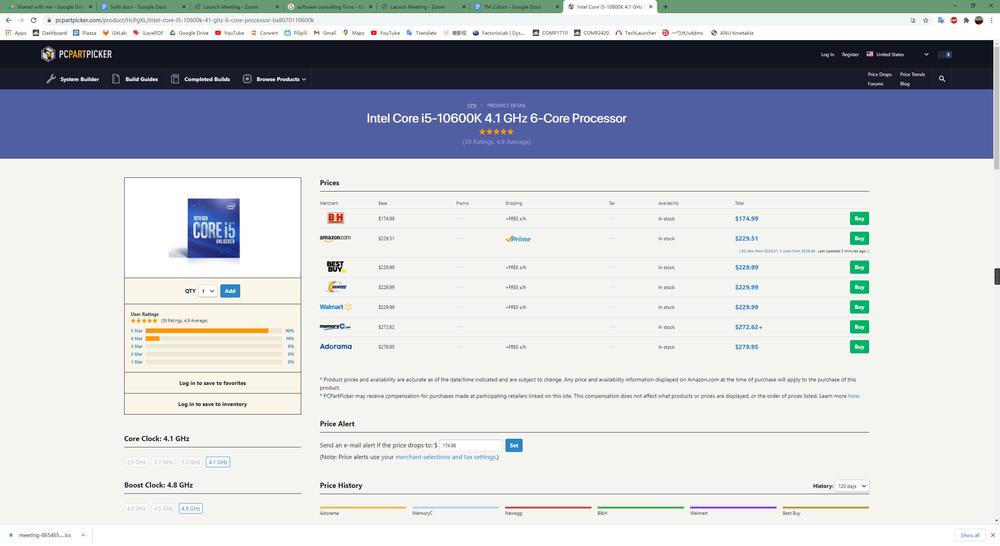

# Rent Me  
## TechLauncher Project 2021 S1 | 20-S1-2-C Rent Me

<h2><a name = "content"> Contents </a></h2>

<a href = "#Title1"><b> 1. Project Overview </b></a> 
<a href = "#Title2"><b> 2. Project Administration </b></a> 
<a href = "#Title3"><b> 3. Traceability of Progress & Teamwork </b></a>  
<a href = "#Title4"><b> 4. Documentation </b></a>  
<a href = "#Title5"><b> 5. Technical Tools and Constraints </b></a> 

<h2><a name = "Title1"> 1. Project Overview </a></h2>

* Background : Australian realstate market is currently dominated by a few digital property listing platforms. Each of these platforms have their own website and mobile application that allows users to search for properties based on preferences. Since each individual platform cannot provide a full picture of the marketplace alone, people need to search across all these marketing platforms which is inconvenient. In order to solve this problem, we are seeking to create a single platform with 1Search functionality that mines all the other realstate marketing platforms covering the ACT. This will enable people who are looking to find rental in the ACT area to search based on their preferences efficiently by saving people from having to replicate searches on multiple marketing platforms. 
* Our Project attempts to build a digital platform that mines all relevant rental realestate digital marketing platforms and creates a single visually engaging profile of the current rental market place based on a set of search preferences.

* **For Who?** : People who are looking for rental property in the ACT region.

* [**Stakeholders of the Project**]()
 

<h2><a name = "Title2"> 2. Project Administration </a></h2>

* [**Team Members & Roles**](https://docs.google.com/document/d/1fvQ1xs856Efw_YJWQ-qfqQBf3QegBSIY/edit)
* [**Estimated Schedule**]()
* [**Deliverables**]()
* [**Statement of Work**]()

<h2><a name = "Title3"> 3. Traceability of Progress & Teamwork</a></h2>

* [**Trello**](https://trello.com/b/gTyl0lOg/rent-me)
* [**Weekly Working Hours Log**](https://docs.google.com/spreadsheets/d/1Huy4oqIJKJm4Vkn6GjLEtLAvzbS3CscQ/edit#gid=309276874)

<h2><a name = "Title4"> 4. Documentation</a></h2>

- [**All**](https://drive.google.com/drive/folders/17aalpBC9I1HCR1vOtDDlglnhUeag19HO)
- [**Decision Log**](https://docs.google.com/document/d/1PFJKcLJ47VJA7OFFqUJz6pPIkWqLANEv/edit)
- [**Output**](https://drive.google.com/drive/folders/1zbk2LxXfnSMFEAYVfDYoexRJb64LZHgY)
- [**Feedback & Reflection Log**](https://drive.google.com/drive/folders/1fji1iAdRe-emCUcqbeNsSwEtN5k7nVww)
- [**Meeting Minutes**](https://drive.google.com/drive/folders/1IbVtywbIS1qwB8ISsmpx62VK-qDph2TG)
    + [Team Meeting](https://drive.google.com/drive/folders/1XMAPlglsns4YBPFGvZf7iqlP7iFEoRbF)
    + [Client Meeting](https://drive.google.com/drive/folders/1dJAHxGxn7BYqYRFs4GH5LcoclcOFS3Pm)
- [**User Story Map**]()
- [**Acceptance Criteria**]()
- [**Risk Register**](https://docs.google.com/document/d/12V6pKKfxoXlXmiiIE7Pc39k2eWCI9qsd/edit)

<h2><a name = "Title5"> 5. Technical Tools and Constraints</a></h2>
  
 <h3> Technical Tools </h3>
 <h4> Communication </h4>
    Team Communication: Slack  
    Team Meetings: Zoom  
    Non-official Notifications: Facebook Messager  
 <h4> Programming </h4>
    Website GUI: Python Django  
    Database Establishment:  

 <h3> Project Constaints </h3>
 
 The priority of the project is to establish a searching engine that integrate the real-estate rental sources into one website which may impose potential ethical or legal issues related to Data Mining and Crawling. 

