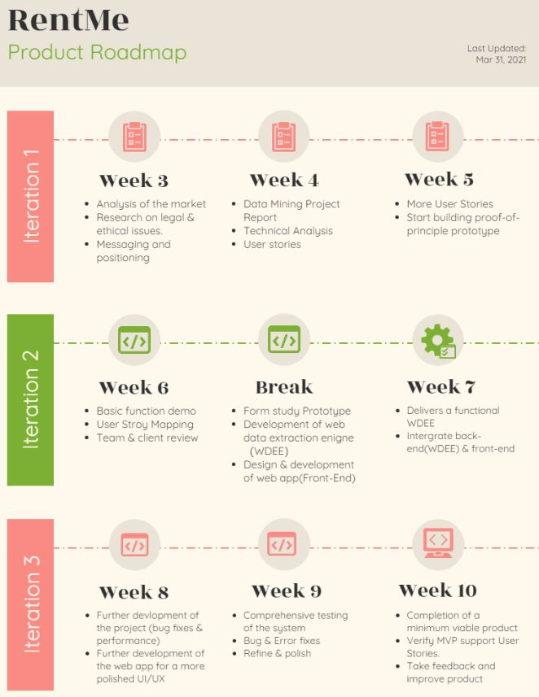

# Rent Me  
## TechLauncher Project 2021 S1 | 20-S1-2-C Rent Me

<h2><a name = "content"> Contents </a></h2>

<a href = "#Title1"><b> 1. Project Overview </b></a> 
<a href = "#Title2"><b> 2. Project Administration </b></a> 
<a href = "#Title3"><b> 3. Traceability of Progress & Teamwork </b></a>  
<a href = "#Title4"><b> 4. Documentation </b></a>  
<a href = "#Title5"><b> 5. Technical Tools and Constraints </b></a> 

<h2><a name = "Title1"> 1. Project Overview </a></h2>

* Background : Australian realstate market is currently dominated by a few digital property listing platforms. Each of these platforms have their own website and mobile application that allows users to search for properties based on preferences. Since each individual platform cannot provide a full picture of the marketplace alone, people need to search across all these marketing platforms which is inconvenient. In order to solve this problem, we are seeking to create a single platform with 1Search functionality that mines all the other realstate marketing platforms covering the ACT. This will enable people who are looking to find rental in the ACT area to search based on their preferences efficiently by saving people from having to replicate searches on multiple marketing platforms. 
* We are going to build up a search engine that integrates the real-estate properties information in ACT Canberra from the main four Real-estate business websites. Thus, end-users who seek potential rental sources could search only on our App/website to access all possible relevant properties rather than repeatedly having to search, skim and compare individually on all those websites.

* **For Who?** : People who are looking for rental property in the ACT region.

* [**Stakeholders of the Project**]()
 

<h2><a name = "Title2"> 2. Project Administration </a></h2>

* [**Team Members & Roles**](https://docs.google.com/document/d/1BrTsg5U2asHrq88uTKnuOLFxd5DlJmhI/edit)

| Team Member      |Email                 | Leadership Role         |  Programming Role    |                 
|------------------|----------------------| ------------------------|----------------------| 
| Maojun Zhu       | u6170753@anu.edu.au  | Project Manager         |   Back-end           |
| Ting He          | u6969378@anu.edu.au  | Vice Project Manager    |   Front-end          |
| Manguang Zhao    | u6482640@anu.edu.au  | Technical Lead          |   Front-end          | 
| Tongtong Jia     | u7148137@anu.edu.au  | Vice Technical Lead     |   Back-end           | 
| Yifan Hu         | u7214873@anu.edu.au  | Project Analyst         |   Front-end          |  
| Qiang Guo        | u7099144@anu.edu.au  | Project Analyst         |   Front-end          | 
| Yi Gu            | u7196494@anu.edu.au  | Project Analyst         |   Front-end          | 

* [**Statement of Work**](https://docs.google.com/document/d/11B9gsdrsujkUEVvkv23MpzDI7thCoOQ2/edit)
* [**Legal & Ethical Analysis**](https://docs.google.com/document/d/1_cq8wbcWk8cDKfTUuTF1hOzoPlH3a2gY/edit)
* [**Design Proposal Enhancements**](https://docs.google.com/document/d/1_JoBGKglTsqiKMyQb2GZdpwgQlOrofgNpbCG3IDDveg/edit)
<h4>Project Road-Map: </h4>

<h2><a name = "Title3"> 3. Traceability of Progress & Teamwork</a></h2>

* [**Trello**](https://trello.com/b/gTyl0lOg/rent-me)
* [**Weekly Working Hours Log**](https://docs.google.com/spreadsheets/d/1ZYX2yzu_UdsbZmc5OYlyGa9cQjIEz6QE/edit#gid=115833928)

<h2><a name = "Title4"> 4. Documentation</a></h2>

- [**All**](https://drive.google.com/drive/folders/17aalpBC9I1HCR1vOtDDlglnhUeag19HO)
- [**Decision Log**](https://drive.google.com/drive/folders/1l3bG5cX43u1eDVqZkJgXQ3hC60QuAdzw)
- [**Output**](https://drive.google.com/drive/folders/1KtYPZ-SiqC-2j354KCSDVvHOu0Nygcu5)
- [**Feedback & Reflection Log**](https://drive.google.com/drive/folders/1_amS2v3AFEKDrefKqDbltQ4sXOv7IF8d)
- [**Meeting Minutes**](https://drive.google.com/drive/folders/1gprv_0_vFj7oi3tYAHsvL6NM1GWoXGop)
    + [Team Meeting](https://drive.google.com/drive/folders/1tLlyCvsma1fp4bCF7oYbV5Xe8ILTjyts)
    + [Client Meeting](https://drive.google.com/drive/folders/1ViQPE1cpXgzohYbFqA1VdnkFLWuY19bs)
- [**Risk Register**](https://docs.google.com/document/d/12V6pKKfxoXlXmiiIE7Pc39k2eWCI9qsd/edit)
- [**Project Client Map**](https://docs.google.com/document/d/1_ntseUcuVU4BBpGwNaiOSEn6pt99rQlX6XPTmqCkTcQ/edit)
- [**Value Proposition Canvas**](https://docs.google.com/document/d/179jEUXpwKIaBmfkO9_ikjP4BBQBbEAEnZgPnsn75-C4/edit)

<h2><a name = "Title5"> 5. Technical Tools and Constraints</a></h2>
  
 <h3> Technical Tools </h3>
 <h4> Communication: </h4>
    Team Communication: <b>Slack</b>  
    Team Meetings: <b>Zoom</b>  
    Non-official Notifications: <b>Facebook Messager</b>  
 <h4> Programming: </h4>
    Website GUI: <b>Java</b>  

 <h3> Project Constaints </h3>
 
 The priority of the project is to establish a searching engine that integrate the real-estate rental sources into one website which may impose potential ethical or legal issues related to Data Mining and Crawling. 

